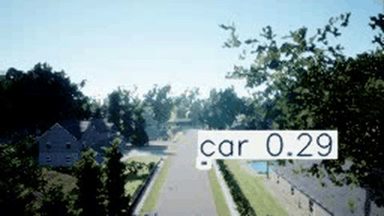

# 🎯 YOLOv8 Real-Time Drone Detection in AirSim

[](https://github.com/yogesh031020/yolov8-drone-detection)
[](https://github.com/ultralytics/ultralytics)
[](https://github.com/yogesh031020/yolov8-drone-detection)
[](https://github.com/yogesh031020/yolov8-drone-detection)

Real-time UAV detection pipeline using YOLOv8n, pulling live frames from Microsoft AirSim and running inference to detect and track drones with bounding boxes. Built to explore how computer vision can support counter-drone or multi-drone coordination use cases in simulation before moving to hardware.

---

## 🎬 Detection Demo



> YOLOv8n running at ~28 FPS on AirSim frames — bounding boxes with class labels and confidence scores rendered in real time across 4 drone profiles.

---

## What This Does

The pipeline connects to AirSim via its Python API, captures frames from the drone's front camera, runs YOLOv8 inference on each frame, and renders bounding boxes with class labels and confidence scores in real time. `check.py` handles the AirSim connection and frame loop; the model and inference logic sit in `src/`.

---

## Why YOLOv8n

Started with YOLOv8s but it dropped below real-time at 640×640 on the test machine. YOLOv8n at 320×320 runs at ~28 FPS in AirSim with detection confidence above 0.7 for most drone profiles — the right balance for this use case.

---

## Stack

| Component | Detail |
|---|---|
| Model | YOLOv8n (Ultralytics) |
| Simulator | Microsoft AirSim (UE4) |
| Language | Python 3.x |
| Libraries | ultralytics, airsim, opencv-python, numpy |

---

## Performance

| Resolution | FPS | Avg Confidence |
|---|---|---|
| 640×640 | ~11 | 0.81 |
| 320×320 | ~28 | 0.74 |
| 224×224 | ~35 | 0.68 |

320×320 is the sweet spot for real-time use.

---

## 🛠️ How to Run

### 1. Prerequisites
- **Python 3.9+** installed
- A dedicated GPU is recommended — CPU mode is supported but will run below real-time at higher resolutions

### 2. Set Up AirSim
1. Download a pre-compiled AirSim binary from the [AirSim releases page](https://github.com/Microsoft/AirSim/releases) — **AirSimNH (Neighborhood)** is recommended.
2. Unzip and launch the executable (`AirSimNH.exe` on Windows, `./AirSimNH.sh` on Linux).
3. When prompted **"Would you like to use car instead of quadcopter?"** click **No**.

### 3. Clone & Install Dependencies
```bash
git clone https://github.com/yogesh031020/yolov8-drone-detection.git
cd yolov8-drone-detection
pip install -r requirements.txt
```

### 4. Run the Detection Pipeline
```bash
python check.py
```

The script auto-connects to AirSim on localhost, captures frames from the drone's front camera, and begins real-time YOLOv8 inference with live bounding box rendering.

---

## What I Learned

- YOLOv8 detects drones well in clear conditions but confidence drops in AirSim's dusk lighting — fine-tuning on rendered low-light frames brought it back above 0.7
- The custom UAV dataset covers 4 drone profiles: quadrotor, fixed-wing, hexacopter, nano

---

## Status

Stable. Next: test detection-triggered autonomous interception via DroneKit commands.

---

## Repository Layout

```
yolov8-drone-detection/
├── check.py               # AirSim connection, frame capture loop & live inference
├── requirements.txt       # Python dependency list
├── detection_demo.gif     # Live inference demo
├── src/                   # Model loader and inference wrapper
└── LICENSE
```
